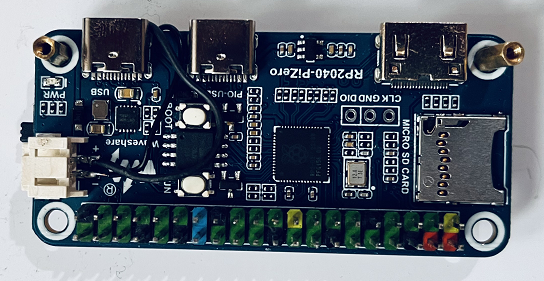

## Napoleon Console for Raspberry Pi Pico

This small game console is made of  [Waveshare RP2040-PiZero](https://www.waveshare.com/rp2040-pizero.htm) and [1.3inch 240x240 IPS LCD display HAT](https://www.waveshare.com/1.3inch-lcd-hat.htm). The games are stored statically in the flash and the size of flash is 16MB. 

You can navigate the menu using joystick button on the HAT. Press the center of the joystick to enter. **KEY1** act as a back button. On **Sokoban** game, the **KEY3** act as undo and **KEY2** act as reset.

Settings and the game progress are stored in the special area of flash.

Some pins of the SD card interface are shared with the buttons of the LCD HAT. Therefore, we cannot use the SD card to store games. Also, the display does not expose the TE pin. So, we cannot prevent the tearing effect.

## Installing Firmware
Hold the boot button on the board and plug it to PC. New removable drive will appear in My Computer. Copy the **Napoleon_Console.uf2** file into that new drive. Unplug the board and connect the board with LCD display HAT. Power up the board using the USB connector.

## Installing Battery

Even if we put rp2040 into deep sleep mode, other accessories will drain the power from the battery. Therefore, we will use a switch to cut off the battery power from the system. You will need to turn **ON** this switch when charging the battery.

## Compiling Firmware
Install Arduino IDE and add the following board URL: 

https://github.com/earlephilhower/arduino-pico/releases/download/global/package_rp2040_index.json

Go to **Board Manager** and type "**pico**" in the search box then add **Raspberry Pi Pico/RP2040 by Earle F. Philhower**.

Extract the content of the "**required libs.zip**" into arduino library directory.

Open the "**Napoleon_Console.ino**" file using Arduino IDE. Select "**Waveshare RP2040 PiZero**" as board. Select the COM port. Set Flash Size to "**16MB  (no FS)**". Set CPU Speed to "**125 MHz**". 

Hit Compile...

(You may need to install serial drivers using [Zadig](https://zadig.akeo.ie/).)
